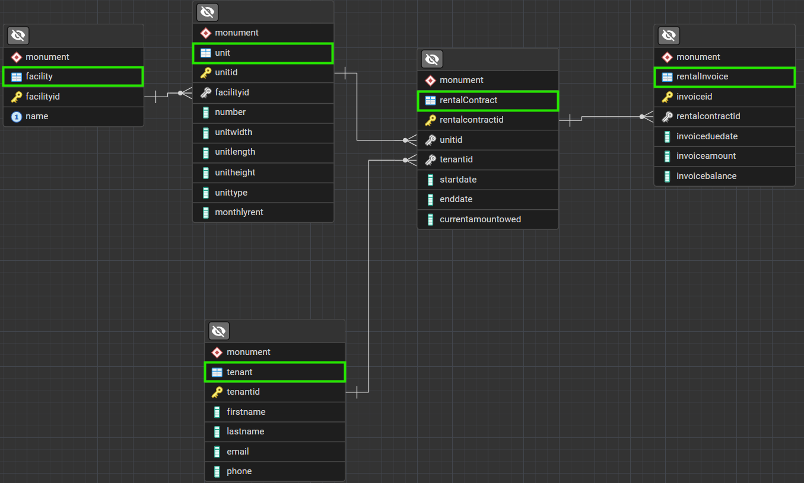

## defined-schema-migration
---
Ingestion logic for particular self-storage data

### This Repo:
- It's a simple migration tool designed to ingest .csv data into a defined relational schema.
- This is the schema's ERD (I called `monument`):

### Setup to run the migration:

### Issues:
- Invoice data seems incomplete, the rules for `invoiceAmount` were defined with the available data.
- ....

### Assumptions made:
- I assumed that the `unit.csv` may have several extra records, instead of +300 .csv files, and the file will be received only once from the client.
  - If we’re dealing with multiple files with the same schema (to start to ingest into our fixed layer), then it needs an “append” job running first to unify the data.
  
- Since the legacy data is coming from a single legacy system, I assumed that `facilityName` and `unitNumber` don't contain inconsistencies (e.g. other units in `rentRoll.csv` that are not in the `unit.csv`).
  - If they would present inconsistencies (most likely), some pre-processing would be required to unify the source-of-truth list. Business should be contacted for such occurrence, and another consequence is that we would need to enable `NULLS` for some columns, at least (and maybe other with further analysis):
    - `monument.rentalContract.unitId`
    - `monument.rentalContract.startDate`
    - `monument.unit.number`

- (Maybe not a good assumption), but I assumed you have a frequent data load into a `unit.csv` and a `rentRoll.csv` following the same csv table format over time, just appending or changing the data within, so I chose to load the data in a “bronze layer” for better data manipulation, debugging with SQL, and make it available for whatever other possible use downstream (usually an important step). But maybe we are not interested in storing client’s raw data in an RDBMS.

- I assumed `rentalInvoice.invoiceAmount` to be `monthlyRent`, due to lack of data, I thought it would make sense.

- `rentalInvoice.invoiceDueDate` = first date of the next month after `startDate`

**Helpers for the developemnt:** As helpers I used official documentation mainly to check functions parameters because I already worked in very similar scripts with similar needs.

**Trade-off's with the chosen approach:**
| Python | SQL |
|---|---| 
| harder to build dependency order in case of too many tables | easier to build an automatic dependency graph  |
| easier to do verifications before loading | harder to import built-in validation steps in the process |
| stores data in python runtime (may be expensive) | apply transformation rules directly in the database (may be way more performant and cheaper) |
| costly to guarantee idempotency | easier and cheaper to guarantee idempotency (UPSERTs - MERGE Scripts) |
| easier to run and integrate with programmatic workflows, environment and CI/CD | harder to modularize and integrate with CI/CD, step-by-step automated process |
| more observability throughout intermediate process | less observability among intermediate steps

